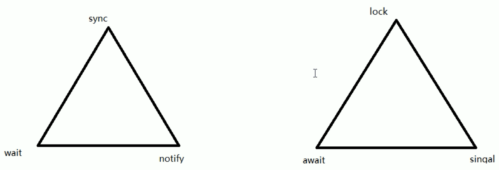

# Synchronized和Lock的区别

## 前言

早期的时候我们对线程的主要操作为：

- synchronized wait  notify

然后后面出现了替代方案

- lock await  singal



## 问题

### synchronized 和 lock 有什么区别？用新的lock有什么好处？举例说明

- synchronized 和 lock 有什么区别？用新的lock有什么好处？举例说明

1）synchronized属于JVM层面，属于java的关键字

- ​	monitorenter（底层是通过monitor对象来完成，其实wait/notify等方法也依赖于monitor对象 只能在同步块或者方法中才能调用 wait/ notify等方法）
- Lock是具体类（java.util.concurrent.locks.Lock）是api层面的锁

2）使用方法：

- synchronized：不需要用户去手动释放锁，当synchronized代码执行后，系统会自动让线程释放对锁的占用

- ReentrantLock：则需要用户去手动释放锁，若没有主动释放锁，就有可能出现死锁的现象，需要lock() 和 unlock() 配置try catch语句来完成

3）等待是否中断

- synchronized：不可中断，除非抛出异常或者正常运行完成
- ReentrantLock：可中断，可以设置超时方法
  - 设置超时方法，trylock(long timeout, TimeUnit unit)
  - lockInterrupible() 放代码块中，调用interrupt() 方法可以中断

4）加锁是否公平

- synchronized：非公平锁
- ReentrantLock：默认非公平锁，构造函数可以传递boolean值，true为公平锁，false为非公平锁

5）锁绑定多个条件Condition

- synchronized：没有，要么随机，要么全部唤醒
- ReentrantLock：用来实现分组唤醒需要唤醒的线程，可以精确唤醒，而不是像synchronized那样，要么随机，要么全部唤醒

## 举例

针对刚刚提到的区别的第5条，我们有下面这样的一个场景

```
题目：多线程之间按顺序调用，实现 A-> B -> C 三个线程启动，要求如下：
AA打印5次，BB打印10次，CC打印15次
紧接着
AA打印5次，BB打印10次，CC打印15次
..
来10轮
```

我们会发现，这样的场景在使用synchronized来完成的话，会非常的困难，但是使用lock就非常方便了

也就是我们需要实现一个链式唤醒的操作


当A线程执行完后，B线程才能执行，然后B线程执行完成后，C线程才执行

首先我们需要创建一个重入锁

```
// 创建一个重入锁
private Lock lock = new ReentrantLock();
```

然后定义三个条件，也可以称为锁的钥匙，通过它就可以获取到锁，进入到方法里面

```
// 这三个相当于备用钥匙
private Condition condition1 = lock.newCondition();
private Condition condition2 = lock.newCondition();
private Condition condition3 = lock.newCondition();
```

然后开始记住锁的三部曲： 判断   干活  唤醒

这里的判断，为了避免虚假唤醒，一定要采用  while

干活就是把需要的内容，打印出来

唤醒的话，就是修改资源类的值，然后精准唤醒线程进行干活：这里A 唤醒B， B唤醒C，C又唤醒A

```
    public void print5() {
        lock.lock();
        try {
            // 判断
            while(number != 1) {
                // 不等于1，需要等待
                condition1.await();
            }

            // 干活
            for (int i = 0; i < 5; i++) {
                System.out.println(Thread.currentThread().getName() + "\t " + number + "\t" + i);
            }

            // 唤醒 （干完活后，需要通知B线程执行）
            number = 2;
            // 通知2号去干活了
            condition2.signal();

        } catch (Exception e) {
            e.printStackTrace();
        } finally {
            lock.unlock();
        }
```


```

/**
 * Synchronized 和 Lock的区别
 * @author: 陌溪
 * @create: 2020-03-17-10:18
 */

class ShareResource {
    // A 1   B 2   c 3
    private int number = 1;
    // 创建一个重入锁
    private Lock lock = new ReentrantLock();

    // 这三个相当于备用钥匙
    private Condition condition1 = lock.newCondition();
    private Condition condition2 = lock.newCondition();
    private Condition condition3 = lock.newCondition();


    public void print5() {
        lock.lock();
        try {
            // 判断
            while(number != 1) {
                // 不等于1，需要等待
                condition1.await();
            }

            // 干活
            for (int i = 0; i < 5; i++) {
                System.out.println(Thread.currentThread().getName() + "\t " + number + "\t" + i);
            }

            // 唤醒 （干完活后，需要通知B线程执行）
            number = 2;
            // 通知2号去干活了
            condition2.signal();

        } catch (Exception e) {
            e.printStackTrace();
        } finally {
            lock.unlock();
        }
    }

    public void print10() {
        lock.lock();
        try {
            // 判断
            while(number != 2) {
                // 不等于1，需要等待
                condition2.await();
            }

            // 干活
            for (int i = 0; i < 10; i++) {
                System.out.println(Thread.currentThread().getName() + "\t " + number + "\t" + i);
            }

            // 唤醒 （干完活后，需要通知C线程执行）
            number = 3;
            // 通知2号去干活了
            condition3.signal();

        } catch (Exception e) {
            e.printStackTrace();
        } finally {
            lock.unlock();
        }
    }

    public void print15() {
        lock.lock();
        try {
            // 判断
            while(number != 3) {
                // 不等于1，需要等待
                condition3.await();
            }

            // 干活
            for (int i = 0; i < 15; i++) {
                System.out.println(Thread.currentThread().getName() + "\t " + number + "\t" + i);
            }

            // 唤醒 （干完活后，需要通知C线程执行）
            number = 1;
            // 通知1号去干活了
            condition1.signal();

        } catch (Exception e) {
            e.printStackTrace();
        } finally {
            lock.unlock();
        }
    }
}

public class SyncAndReentrantLockDemo {

    public static void main(String[] args) {

        ShareResource shareResource = new ShareResource();

        new Thread(() -> {
            for (int i = 0; i < 10; i++) {
                    shareResource.print5();
            }
        }, "A").start();

        new Thread(() -> {
            for (int i = 0; i < 10; i++) {
                shareResource.print10();
            }
        }, "B").start();

        new Thread(() -> {
            for (int i = 0; i < 10; i++) {
                shareResource.print15();
            }
        }, "C").start();
    }
}
```

