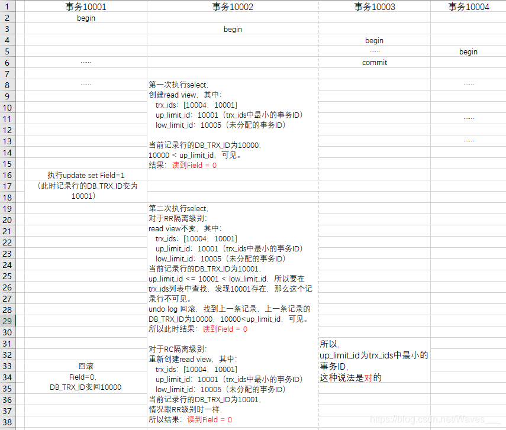

------
引用 https://blog.csdn.net/Waves___/article/details/105295060

## 1、MVCC概念

多版本控制（Multiversion Concurrency Control）: 指的是一种提高并发的技术。最早的数据库系统，只有读读之间可以并发，读写，写读，写写都要阻塞。引入多版本之后，只有写写之间相互阻塞，其他三种操作都可以并行，这样大幅度提高了InnoDB的并发度。在内部实现中，InnoDB通过undo log保存每条数据的多个版本，并且能够找回数据历史版本提供给用户读，每个事务读到的数据版本可能是不一样的。在同一个事务中，用户只能看到该事务创建快照之前已经提交的修改和该事务本身做的修改。

MVCC在 Read Committed 和 Repeatable Read两个隔离级别下工作。

MySQL的InnoDB存储引擎默认事务隔离级别是RR(可重复读)，是通过 "行级锁+MVCC"一起实现的，正常读的时候不加锁，写的时候加锁。而 MVCC 的实现依赖：隐藏字段、Read View、Undo log。

### 1.1、隐藏字段
InnoDB存储引擎在每行数据的后面添加了三个隐藏字段：

1. DB_TRX_ID(6字节)：表示最近一次对本记录行作修改（insert | update）的事务ID。至于delete操作，InnoDB认为是一个update操作，不过会更新一个另外的删除位，将行表示为deleted。并非真正删除。

2. DB_ROLL_PTR(7字节)：回滚指针，指向当前记录行的undo log信息

3. DB_ROW_ID(6字节)：随着新行插入而单调递增的行ID。理解：当表没有主键或唯一非空索引时，innodb就会使用这个行ID自动产生聚簇索引。如果表有主键或唯一非空索引，聚簇索引就不会包含这个行ID了。这个DB_ROW_ID跟MVCC关系不大。
### 1.2、Read View 结构（重点）
其实Read View（读视图），跟快照、snapshot是一个概念。

Read View主要是用来做可见性判断的, 里面保存了“对本事务不可见的其他活跃事务”。

Read View 结构源码，其中包括几个变量，在网上这些变量的解释各种各样，下面我结合源码给出它们正确的解释。
① low_limit_id：目前出现过的最大的事务ID+1，即下一个将被分配的事务ID。  
② up_limit_id：活跃事务列表trx_ids中最小的事务ID，如果trx_ids为空，则up_limit_id 为 low_limit_id。  
③ trx_ids：Read View创建时其他未提交的活跃事务ID列表。意思就是创建Read View时，将当前未提交事务ID记录下来，后续即使它们修改了记录行的值，对于当前事务也是不可见的。  
④ creator_trx_id：当前创建事务的ID，是一个递增的编号，源码 345行 。（这个编号并不是DB_ROW_ID）  
### 1.3、Undo log       
Undo log中存储的是老版本数据，当一个事务需要读取记录行时，如果当前记录行不可见，可以顺着undo log链找到满足其可见性条件的记录行版本。
大多数对数据的变更操作包括 insert/update/delete，在InnoDB里，undo log分为如下两类：
①insert undo log : 事务对insert新记录时产生的undo log, 只在事务回滚时需要, 并且在事务提交后就可以立即丢弃。  
②update undo log : 事务对记录进行delete和update操作时产生的undo log，不仅在事务回滚时需要，快照读也需要，只有当数据库所使用的快照中不涉及该日志记录，对应的回滚日志才会被purge线程删除。  
## 2、可见性比较算法
在innodb中，创建一个新事务后，执行第一个select语句的时候，innodb会创建一个快照（read view），快照中会保存系统当前不应该被本事务看到的其他活跃事务id列表（即trx_ids）。当用户在这个事务中要读取某个记录行的时候，innodb会将该记录行的DB_TRX_ID与该Read View中的一些变量进行比较，判断是否满足可见性条件。

假设当前事务要读取某一个记录行，该记录行的DB_TRX_ID（即最新修改该行的事务ID）为trx_id，Read View的活跃事务列表trx_ids中最早的事务ID为up_limit_id，将在生成这个Read Vew时系统出现过的最大的事务ID+1记为low_limit_id（即还未分配的事务ID）。

具体的比较算法如下（可以照着后面的 例子 ，看这段）:

1. 如果 trx_id < up_limit_id, 那么表明“最新修改该行的事务”在“当前事务”创建快照之前就提交了，所以该记录行的值对当前事务是可见的。跳到步骤5。  

2. 如果 trx_id >= low_limit_id, 那么表明“最新修改该行的事务”在“当前事务”创建快照之后才修改该行，所以该记录行的值对当前事务不可见。跳到步骤4。  

3. 如果 up_limit_id <= trx_id < low_limit_id, 表明“最新修改该行的事务”在“当前事务”创建快照的时候可能处于“活动状态”或者“已提交状态”；所以就要对活跃事务列表trx_ids进行查找（源码中是用的二分查找，因为是有序的）：  

(1) 如果在活跃事务列表trx_ids中能找到 id 为 trx_id 的事务，表明①在“当前事务”创建快照前，“该记录行的值”被“id为trx_id的事务”修改了，但没有提交；或者②在“当前事务”创建快照后，“该记录行的值”被“id为trx_id的事务”修改了（不管有无提交）；这些情况下，这个记录行的值对当前事务都是不可见的，跳到步骤4；  

(2)在活跃事务列表中找不到，则表明“id为trx_id的事务”在修改“该记录行的值”后，在“当前事务”创建快照前就已经提交了，所以记录行对当前事务可见，跳到步骤5。  

4. 在该记录行的 DB_ROLL_PTR 指针所指向的undo log回滚段中，取出最新的的旧事务号DB_TRX_ID, 将它赋给trx_id，然后跳到步骤1重新开始判断。  

5. 将该可见行的值返回。  

